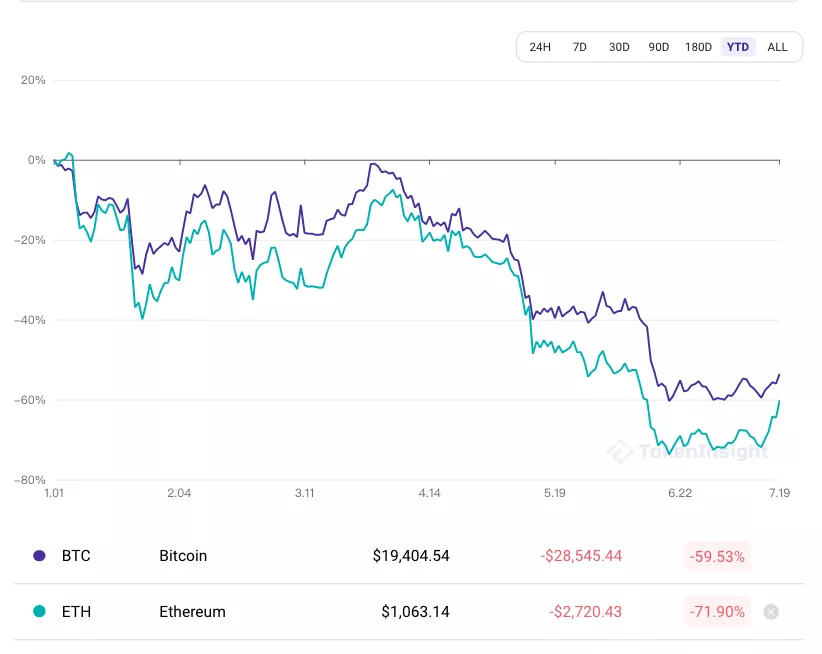
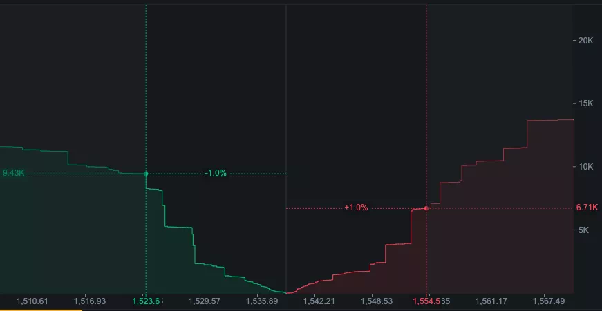

# Gamma squezz  

## 原理
当交易者对某标的有强烈的上涨预期时，会大量购入短期虚值call，造成call价格被拉高。与此同时，机构投资者会选择卖出此期权。  

此时，如果散户继续抬高期权价格，会促使机构卖出更多的call，造成delta对冲时需要买入更多的现货，此举会造成***现货价格进一步上涨***，虚值call逐渐变为实值，Gamma上升，接着导致***Delta上升，需要用更多的标的进行对冲***。受到现货价格上涨以及空头头寸增加的影响，会使机构遭受大量亏损

## 形成条件
1.市场看跌情绪占主导  
2.标的资产流动性普遍较差  
3.标的具有相对完善的衍生品市场  
4.某些看涨信号能够引导市场情绪  

  

